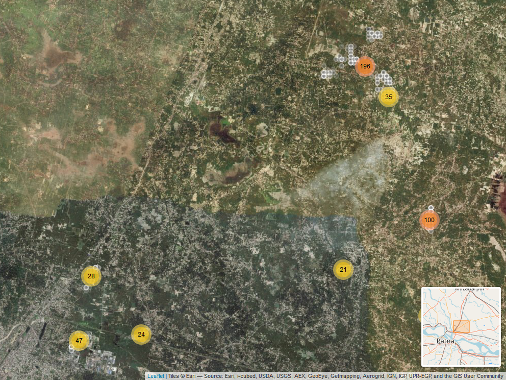

```{r setup_opts, include=FALSE}
knitr::opts_chunk$set(echo = FALSE,error = FALSE,message=FALSE,warning = FALSE)
```

```{r, libraries, include=FALSE}
library(tidyverse)
library(svglite)
library(plotly)
library(jsonlite)
library(httr)
library(partykit)
library(qvcalc)
library(psychotools)
library(PlackettLuce)
library(gosset)
library(stringr)
library(knitr)
library(formattable)
library(scales)
library(leaflet)
library(mapview)
library(tidyr)
library(gtools)
library(magrittr)
#webshot::install_phantomjs()

source("Scripts/functions.R")
source("Scripts/dataimport.R")
source("Scripts/analysis.R")
```

You are reading a report generated by ClimMob. This is a software package to analyze data generated by citizen science or crowdsourcing.

# Introduction  

In agriculture, the local environmental conditions determine to a large degree which technological solutions are the most suitable. In dry soils, for example, drought-resistant crop varieties will outperform other varieties, but in wet soils these same varieties may do worse than most. Not only drought, but an entire range of problems including excessive heat, floods, new pests and diseases tend to intensify under climate change. This multitude of limiting factors requires multiple technological solutions, tested in diverse environments. 
 
Citizen science is based on the cooperation of citizen scientist or observers (paid or unpaid). Researchers assign microtasks (observations, experiments...) that, once completed and gathered, contribute with a great amount of information to science. One of the advantages of citizen science is that agricultural researchers can get access to many environments by crowdsourcing their experiments. As farmers contribute with their time, skills and knowledge to the investigation, researchers are able to do more tests than in a traditional setup. Also citizen scientists acquire new knowledge, abilities and information useful for future challenges of their work.

**ClimMob**

The primary goal of ClimMob is to help farmers adapt to variable and changing climates. ClimMob was created as part of Bioversity International's research in the CGIAR Research Programme on Climate Change, Agriculture, and Food Security (CCAFS). It serves to prepare and analyze citizen science experiments in which a large number of farmers observe and compare different technological options under a wide range environmental conditions (van Etten 2011). 
 
ClimMob software assigns a limited number of items (typically 3 crop varieties or agricultural practices) to each farmer, who will compare their performance. Each farmer gets a different combination of items drawn from a much larger set of items. Comparisons of this kind are thought to be a very reliable way to obtain data from human observers (Martin 2004). Once the results of the microtasks have been collected, ClimMob builds an image of the whole set of assigned objects, combining all observations. ClimMob not only reconstructs the overall ordering of items, but also takes into account differences and similarities between observers and the conditions under which they observe. It assigns similar observers to groups that each corresponds to a different preference profile. Groups are created on the basis of variables such as the characteristics of the plot, geography, age, gender...
 
ClimMob uses a recently published statistical method to analyze ranking data (Strobl et al. 2011). It automatically generates analytical reports, as well as individualized information sheets for each participant. ClimMob will hopefully help many agricultural researchers to start using crowdsourcing approaches in order to accelerate climate change adaptation.
 
Complementary to the microtaks performed by the farmers, a detailed environmental monitoring is performed, using new, cheap sensors (Mittra et al. 2013), makes it possible to compare across sites and predict crop variety performance for new places.
 

**How to cite**

If you publish any results generated with ClimMob, you should cite a number of articles as the package builds on various contributions. Van Etten (2011) introduced the crowdsourcing philosophy behind ClimMob. It is important to mention that ClimMob is implemented in R, a free, open-source analysis software (R Development Core Team 2012). Methodologically, if you report on the tree results, you should mentioned that ClimMob applies the Bradley-Terry tree method published by Strobl et al. (2011). To cite ClimMob itself, mention Van Etten & Calderer (2015).

# Section 1: Headline Results

Overall there were `r nrow(dt.fr)` `r paste0(ranker,"s")` participating in this study. Each `r ranker` assessed three different `r paste0(option,"s")` and ranked them in order of their overall preference. In addition they also provided rankings for `r ntrait` additional traits - `r paste(trait_names,collapse=", ")`. 

Table 1 provides a list of the `r paste0(option,"s")` assessed within this trial, with the frequency and percentage of `r paste0(ranker)`s who assessed each `r paste0(option)`.

```{r, varieties}
kable(vartable,caption=paste0("Table 1: Frequency of ",option,"s  Assessed"))
```


## Overall Differences in Rankings
```{r}
if(ps[1]<0.05){
  line1<-paste0("Overall there were statistically significant differences found in the rankings of ", option ,"s in the overall ranking (p=",ptab$p.value[1],"). The best ranked ", option ,"s overall were ",ptab$`Best Ranked`[1])
}
if(ps[1]>=0.05){
  line1<-paste0("Overall there were no statistically significant differences found in the rankings of ", option ,"s in the overall ranking (p=",ptab$p.value[1],")")
}
if(any(ps[2:length(ps)]<0.05)){
  line1<-paste(line1,". Statistically significant differences were also found in the trait(s)",
               paste(trait_names[ps[2:length(ps)]<0.05],collapse=", "))
  }

```

`r  paste(line1, collapse='\n')`

A summary of the p-values testing the hypothesis that there exist differences in the rankings within each of the Plackett-Luce models fitted for each of the assessed traits, and the list of `r paste0(option,"s")` which were significantly highest and lowest ranked overall, are summarised in Table 1.1.

```{r}
kable(ptab,caption=paste0("Table 1.1: Summary of Differences Found In ",option,"s by Trait"))
```

See Section 3 for further details.

## Effect of covariates

```{r}

if(any(outtabs[[1]]$p.value<0.05)){
 line2<-paste(length(siglist),"of the variables tested were found to have a statistically significant relationship to the overall ranking. These variable(s) were:",  paste(paste0(siglist," (p=",outtabs[[1]][siglist,"p"],")"),collapse=", "))
  
}
if(!any(outtabs[[1]]$p.value<0.05)){
  line2<-"None of the variables tested were found to have a statistically significant relationship to the overall ranking at the 5 % significance level."
}

```

`r  paste(line2, collapse='\n')`

A summary of the univariate signifance levels for all covariates that were able to be tested is shown in Table 1.2.1.
```{r}
kable(uni_sum[,c(5,4)],caption="Table 1.2.1: Summary of univariate p-values for first split in Plackett-Luce tree model for the overall ranking")
```

```{r}
if(length(stoplist)>0){
stopmessage<-paste("The variable(s)",paste(colnames(dt.fr)[covarlist2[stoplist]],collapse=", "), "were not able to be included within the analysis.")
}
if(length(stoplist)==0){
  stopmessage<-""
}

```

`r  paste(stopmessage, collapse='\n')`

```{r}
if(length(siglist)>0){
  line3<-paste0("Table 1.2.2 shows which ",option,"s where identified as the best and worst ranked in the subgroups identified by including covariate data against the overall ranking.")
}
if(length(siglist)<0){
  line3<-""
}

```

`r  paste(line3, collapse='\n')`

```{r}
if(length(siglist)>0){
  kable(node_summary,caption="Table 1.2.2: Summary of different subgroups identified by multivariate Plackett-Luce tree model")
}

```

See Section 4 for further details.

## Relationships between traits

Table 1.3 shows, for each trait in the study, the frequency with which the rankings matched with the overall ranking.

The trait which had the strongest relationship with the overall ranking was `r  strongest_link$trait`. Overall the rankings for `r  strongest_link$trait` matched the rankings for the overall ranking `r  percent(strongest_link$agreement)` of the time.

The trait which had the weakest relationship with the overall ranking was `r  weakest_link$trait`. Overall the rankings for `r  weakest_link$trait` matched the rankings for the overall ranking only `r  percent(weakest_link$agreement)` of the time.
 
 
 
```{r}
kable(agreement_table[,1:2],caption="Table 1.3: Relationship between individual trait assessment and overall assesment")
```
 
See Section 5 for further details.

# Section 2: Data Summary & Exploratory Analysis  

Tables 2.2.1 to `r  paste("2.2.",length(covars),sep="")` summarise the covariate data collected from the survey, with corresponding bar charts or histograms of the responses.


```{r, covars}

covar_expl=NULL

for(i in seq_along(covarlist)){
  covar=i
  covar_expl<-c(covar_expl,knitr::knit_child("covar_analysis.Rmd", quiet=TRUE))
}
```

```{r covarinclude, echo=FALSE, results="asis", message=FALSE, warning=FALSE}
cat(paste(covar_expl, collapse = '\n'))
```

## Location of `r paste0(ranker)`s  
*Figure 2.3*
```{r map_out}

```

## Assessment of `r paste0(option,"s")` 

Exploratory analysis within the following section summarises results from the data directly. Given the structure of a climmob trail, where each `r paste0(ranker)` only assesses 3 of the possible `r paste0(option,"s")` these results may be skewed if certain `r paste0(option,"s")` were randomly assigned to face worse `r paste0(option,"s")` than others. This is particularly a potential issue within a smaller trial, as due to the randomisation process the potential for an unbalanced assignment decreases as the sample size increases. Results from other sections, and in the overall summary use Plackett-Luce models, to adjust for any imbalance [add in references].


### Overall  

Overall performance of each of the `r paste0(option,"s")` is summarised in Table 2.4. 

```{r fav_table}
kable(fav2,row.names = FALSE,caption = "Table 2.4 - Summary of Overall Performance")
```

This shows the % of `r paste0(ranker)`s who assessed the `r paste0(option)` as their most preferred of the 3 `r paste0(option,"s")` they were provided, the % of `r paste0(ranker)`s who included the `r paste0(option)` as their least preferred, the % of 'head to head contests' for which the `r paste0(option)` won and the net favourability score. A score of +100 indicates the `r paste0(option)` won all 'contests' it was involved in, a score of 0 indicates an equal number of wins and losses, a score of -100 indicates the variety lost all contests. 

*Figure 2.4*
```{r fav_plot}
favourability_plot(fav1)+ggtitle("Net Favourability Score for Overall Performance")+ylim(-100,100)+xlab(option)
```

The variety `r fav2[1,1]` was the most preferred `r paste0(option)` overall being ranked highest by `r fav2[1,3]` of the `r fav2[1,2]` `r paste0(ranker)`s who assessed this `r paste0(option)`. 

Other `r paste0(option,"s")` with strong positive rankings were `r paste(fav2[fav2[,6]>50,1][-1],collapse=", ")`


### Other Traits  

Net favourability scores are shown below for the other traits assessed in this study.

```{r, traitsplots}
trait_summaries=NULL
for(i in 1:length(trait_names)){
  
  trait_summaries<-c(trait_summaries,knitr::knit_child("trait_analysis.Rmd", quiet=TRUE))
}
```

```{r traitinclude, echo=FALSE, results="asis", message=FALSE, warning=FALSE}
cat(paste(trait_summaries, collapse = '\n'))
```

## Pairwise Contests 

Appendix B contains the full data for each pairwise comparison of the varieties, which is summarised in the plots below.

### Overall 

Figure 2.6 shows the outcomes of all pairwise contests between the `r paste0(option,"s")` included in the trial. Each panel shows the performance of one `r paste0(option)` against all the other `r paste0(option,"s")`, and shows the % of the times in which the panelled `r paste0(option)` was ranked above the `r paste0(option,"s")` shown as bars. The most preferred `r paste0(option)` is shown in the top left panel and the least preferred is shown in the bottom right panel

*Figure 2.6*
```{r contests bars,fig.height=12,fig.width=10}
cont1[[2]]+ggtitle("Head to Head Performance of All Varieties Using Overall Trait Preference")+
  ylab("% Contests Preferred")

```

### Other Traits 

Results from the pairwise contests of the other individual traits assessed are shown below. 

```{r, pairsplots}
trait_pairs1=NULL
for(i in 1:length(trait_names)){
  trait_pairs1<-c(trait_pairs1,knitr::knit_child("trait_pairs.Rmd", quiet=TRUE))
}
```

```{r traitincludepairs, echo=FALSE, results="asis", message=FALSE, warning=FALSE}
cat(paste(trait_pairs1, collapse = '\n'))
```


## Relationship between traits  

Table 2.9 shows the relationship between the individual trait rankings and the overall rankings.  
Complete agreement represents the percentage of respondents for which the ranking of the three `r paste0(option,"s")` in respect to the trait is an exact match to the overall ranking. Best/worst agreement represents the percentage for which the best/worst `r paste0(option)` for the trait matched the overall best/worst.

```{r}
kable(agreement_table,caption="Table 2.9: Relationship between individual trait assessment and overall assesment")
```

*Figure 2.9*

```{r correspondence,fig.width=9,fig.height=6}
plot(agreement_traits[[1]])

agreement_traits
```

Overall the trait which had the strongest relationship with the overall ranking was `r agreement_traits[[2]][ntrait,1]`, with identical rankings being given as the overall ranking `r agreement_traits[[2]][ntrait,3]` of the time.

# Section 3: Plackett-Luce Models of Ranking Differences

## Overall Ranking

Table 3.1 shows the results from the likelihood ratio test from the Plackett-Luce model for overall rankings of the different `r paste0(option,"s")`. The hypothesis being tested is that there is no difference in the assessments of any of the different `r paste0(option,"s")`.

```{r,aov1}
x1<-anova.PL(mod_overall)
p<-x1[2,5]
x1[,5]<-paste(format.pval((x1[,5])),stars.pval((x1[,5])))
kable(x1,caption="Table 3.1: Likelihood ratio test results from overall model")
```

```{r,pval_sentence}
if(p<0.001){
message1<-paste("p=",format.pval((p)), ". This suggests that there is strong evidence of a difference in the rankings between",option,"s",sep="")
}

if(p<0.01 & p >0.001){
message1<-paste("p=",format.pval((p)), ". This suggests that there is evidence of a difference between",option,"s",sep="")
}
if(p>0.01 & p <0.05){
message1<-paste("p=",format.pval((p)),". This suggests that there is some evidence of a difference between",option,"s",sep="")  
}
if(p>0.05){
message1<-paste("p=",format.pval((p)),". This suggests that there is not enough evidence to conclude that there are differences between",option,"s",sep="")  
}
```

`r message1`

Figure 3.1 shows the estimates of the model coefficients with 84% confidence intervals. The purpose of this graph is to be able to best distinguish between the relative strength of each of the `r paste0(option,"s")` assessed. As such the coefficient estimates themselves are not directly interpretable, but it can be concluded that a higher value for the coefficient indicates that a variety has been more preferred. The 84% confidence width is chosen so that non-overlapping confidence intervals could be interpreted as indicating significant differences at the 5% significance level. This may not match exactly with the mean seperation groupings, as these groupings also take into account multiple testing through the Benjamini and Hochberg adjustment. [add references here].
Mean separation analysis was also conducted to indicate, using letters, which `r paste0(option,"s")` are significantly more preferred than others: when varieties have at least one letter in common, there is not enough evidence from the experiment to be confident about their relative order of preference at the 5% significance level. 

*Figure 3.1 - Overall Ranking: Model Coefficients and Mean Separation*
```{r est_plot, fig.width=7,fig.height=7}
plot.multcompPL(model_summaries,level=0.84)+
  ggtitle("Overall Preference Estimates w/ 84% Confidence Intervals",
  subtitle="Groups created from pairwise contrasts at 5% level\nwith Benjamini & Hochberg adjustment")
```

The same information as Figure 3.1 is shown in Table 3.2 below

```{r est_table}
model_summaries %>% 
  select(estimate,quasiSE,.group) %>%
  rename("Estimate"=estimate,"Group"=.group) %>%
  kable(digits=2,caption=paste0("Table 3.2 - Model Coefficients and Mean Separation of",option,"s at 5% Level with Benjamini & Hochberg adjustment"))
```

Table 3.3 and Figure 3.2 use the coefficients from the model to estimate the probability of each `r paste0(option)` being considered to be the top ranked `r paste0(option)` in a direct comparison between all of the possible varities.

```{r}
kable(worthscaled[,-2],caption = "Table 3.3: Percentage probability of being the highest ranked overall")
```

*Figure 3.2 - Overall Ranking: Probability of Being The Highest Ranked Overall*
```{r}
ggplot(data=worthscaled,aes(y=worth,fill=worth,group=Variety,x=1))+
  geom_bar(stat="identity",col="black",show.legend = FALSE)+
  theme_void()+
  geom_text(aes(y=cumsum(rev(worth))-rev(worth)/2,size=rev(worth),
                label=rev(paste(Variety,percent(worth),sep=": "))),show.legend = FALSE,fontface=2)+
  ggtitle(paste("Probability that",option,"is the\nhighest ranked overall"))+
  scale_fill_gradient(low="white",high="forestgreen")+
  scale_size_continuous(range=c(0.5,10))
```


```{r, traitmodels}

model_traits<-NULL
for (i in 1:ntrait){
  model_traits<-c(model_traits,knitr::knit_child("trait_models.Rmd", quiet=TRUE))
}
```


```{r traitmodinclude, echo=FALSE, results="asis", message=FALSE, warning=FALSE}
cat(paste(model_traits, collapse = '\n'))
```

# Section 4: Plackett Luce Models With Covariates  

## Overall Ranking  

A classification tree approach was used to determine which of the covariates, if any had significant relationships with the rankings. This approach identifies sub-groups in the data for which the rankings of the different varieties are significantly different to each other. Table 4.1 shows the p-values for each of the covariates tested, one-by-one, showing whether or not the covariate could be used to define sub-groups with significantly different rankings. 
```{r}
kable(uni_sum[,c(5,4)],caption="Table 4.1: Univariate p-values for first split in Plackett-Luce tree model for the overall ranking")
```


```{r,include=FALSE}
covarlist2=c(covars,coords)

univariate_model=NULL
pout<-NULL
for(i in 1:length(covarlist2)){
if(stoplist[i]==0){
  covar=covarlist2[i]
 univariate_model<-c(univariate_model,knitr::knit_child("covar_models.Rmd", quiet=TRUE))
    }
   if(stoplist[i]==1){
  univariate_model<-c(univariate_model,paste("NOTE: ",colnames(dt.fr)[covarlist2[i]],"was not considered as a covariate - not all varieties observed within all groups\n"))
   }
     if(stoplist[i]==2){
  univariate_model<-c(univariate_model,paste("NOTE: ",colnames(dt.fr)[covarlist2[i]],"was not considered as a covariate - only 1 unique value\n"))
     }
     if(stoplist[i]==3){
 univariate_model<-c(univariate_model,paste("NOTE: ",colnames(dt.fr)[covarlist2[i]],"was not considered as a covariate - not an applicable data type\n"))
     }

}


```

Figure 4.1 shows the partitioning of the rankings based on the most significantly different sub-groups which could be identified from the data using a 5% significance level. At the top of the tree is the full dataset, then working down through the different levels of the tree shows the combinations of variables which define each subgroup. The model parameters are shown for the final subgroups ("terminal nodes") in the plots at the bottoms of the tree. 

*Figure 4.1 - Overall Ranking Plackett-Luce Tree Considering All Possible Covariates*
```{r,asis=TRUE,fig.height=8,fig.width=10}
if(length(tree_f)>1){
    rval1<-node_terminal1(tree_f)
plot(tree_f,terminal_panel =rval1 )
}
if(length(tree_f)==1){
    print("No figure produced: no significant covariates identified")
}
```


The highest and lowest performing `r paste0(option)` within each sub-group is identified within Table 4.2.

```{r}
kable(node_summary,caption="Table 4.2 - Summary of Performance in Each Node")
```

The model coefficient estimates, along with 84% confidence intervals are provided in Figure 4.2. This will help identification of which `r paste0(option,"s")` were better suited to particular sub-groups identified by the analysis.

*Figure 4.2 - Coefficient Estimates Within Each Identified Terminal Node Subgroup*
```{r,fig.width=8,fig.height=8}
if(length(tree_f)>1){
ggplot(data=coefs,aes(x=term,y=ctd,ymax=ctd+1.40*quasiSE,ymin=ctd-1.40*quasiSE,col=Label))+
    geom_point(position = position_dodge(width=0.3),size=1)+
    geom_errorbar(position = position_dodge(width=0.3),width=0)+
    coord_flip()+
    geom_text(aes(label=.group),size=3,fontface=2,nudge_x=rep(c(-0.3,0.5),each=nlevels(coefs$term)))+
    ylab("")+
    xlab("Variety")+
    ggtitle(paste("Terminal node parameter estimates for","overall","rankings."),
            subtitle = paste("Covariates considered:",paste(colnames(dt.fr)[covarlist3],collapse=", ")))
}
if(length(tree_f)==1){
    print("No figure produced: no significant covariates identified")
}
```

Table 4.3 outlines the p-values for each covariate at each of the nodes in the tree, outlining whether an additional significant split could be determined from within the existing sub-group at that node.

```{r}
z<-NULL
for(i in 1:length(outtabs)){
  if(ncol(outtabs[[i]])>2){
    ot<-data.frame(parameter=rownames(outtabs[[i]]),outtabs[[i]])
    z<-rbind(z,ot)
  }
}
kable(z[,c(1:3,5)],caption="Table 4.3: p-values for effect of each covariate at each node",row.names = FALSE)

```


## Univariate analysis

`r  paste(univariate_model, collapse='\n')`

# Section 5: Relationship between Traits  

Partial least squares regression was used to determine relationship between the specific traits and the overall rankings. 

*Figure 5.1 - Partial Least Squares Biplot of Relationship Between Traits and Overall Performance*
```{r pls}
ggplot(data=arrows,aes(y=Comp.2,x=Comp.1,label=trait,yend=y0,xend=x0))+
    geom_hline(yintercept = 0)+geom_vline(xintercept = 0)+
    geom_segment(col="red",arrow = arrow(length = unit(0.5, "cm"),ends = "first" ))+
  geom_abline(linetype=2,col="gray50",slope=(yve[2]-yve[1])/yve[1],intercept=0)+
      geom_text(fontface=2,size=6,col="red")+
        geom_text(data=scores,aes(y=Comp.2,x=Comp.1,label=var),inherit.aes=FALSE,fontface=2,size=3)+
          xlab(paste("Component 1:",formattable::percent(yve[1]),"of Variance in Overall Ranking"))+
            ylab(paste("Component 2:",formattable::percent(yve[2]-yve[1]),"of Variance in Overall Ranking"))

#would be nice to connect variety position to dashed line at this point 


```

The first two components recombining the specific traits are able to explain `r percent(yve[2])` of the variability in the overall ranking. 
The dashed line represents the overall ranking, with an increase in performance as the x and y axes increase. 

Varieties positioned close to the dashed line will be performing equally across all traits; varieties positioned further away from the dashed line, on either side, will have varying performance in different traits. Better performance in traits will correspond with arrows pointing in the direction away from the dashed line and worse performance in traits directed on the opposite side.

Traits with arrows pointing in similar directions have a similar relationship to the overall ranking. Traits with arrows more closely following the dashed line will have a stronger relationship to the overall ranking.

*Table 5.1 - Partial Least Squares Regression Model Of Traits Against Overall Ranking*
```{r regression}
jack.test(m2,nc)
```

Table 5.1 summarises the regression model between the rankings of each trait of an individual variety and the overall ranking. The most positive value will be associated with the trait which can explain the largest proportion of the variability in the overall ranking. Due to the strong correlation in rankings for different traits it would be expected for some of these coefficients to be negative. An individual negative value does not neccesarily indicate a negative relationship overall between that trait and the overall ranking; rather that holding all other rankings constant and increase ranking for that trait would not neccesarily be expected to result in an increase in the overall ranking. 

# Appendix A: Summary of Fixed Parameters Used
TBD

# Appendix B: All Pairwise Treatment Contests

```{r}


overall<-cbind(data.frame(cont1[[3]]) %>% mutate(v1=rownames(.)) %>% gather(v2,Percent,-v1),
data.frame(cont1[[4]]) %>% gather(v2,n) %>% select(n)) %>%
  filter(v1!=v2) %>%
  arrange(v2,v1)%>%
  mutate(Overall=percent(Percent)) %>%
  select(v2,v1,n,Overall) 

for(i in 1:length(contests_t)){
  tmp<-cbind(data.frame(contests_t[[i]][[3]]) %>% mutate(v1=rownames(.)) %>% gather(v2,Percent,-v1),
data.frame(cont1[[4]]) %>% gather(v2,n) %>% select(n)) %>%
  filter(v1!=v2) %>%
  arrange(v2,v1)%>%
  mutate(Percent=percent(Percent)) 
  overall$tmp<-tmp$Percent
  colnames(overall)[ncol(overall)]<-trait_names[i]
}


overall%>%
  rename(`Variety 2`=v1,`Variety 1`=v2,`Number of Contests`=n) %>%
  kable(caption="Pairwise: % of Contests Where Variety 1 Was Preferred to Variety 2")

```


# References
TBD