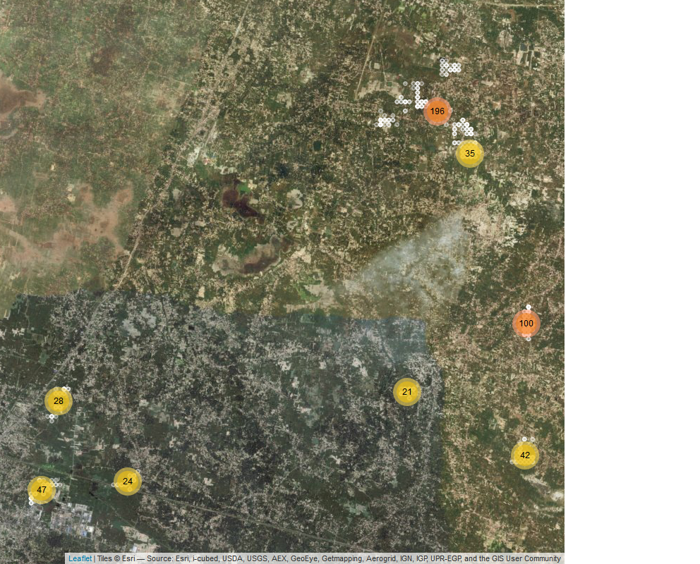

```{r setup_opts, include=FALSE}
knitr::opts_chunk$set(echo = FALSE,error = FALSE,message=FALSE,warning = FALSE)
```

```{r, libraries, include=FALSE}
library(tidyverse)
library(svglite)
library(plotly)
library(jsonlite)
library(httr)
library(partykit)
library(qvcalc)
library(psychotools)
library(PlackettLuce)
library(gosset)
library(stringr)
library(knitr)
library(formattable)
library(scales)
library(leaflet)
library(mapview)
#webshot::install_phantomjs()

source("functions.R")
```

```{r, inputs, include=FALSE}
#using internal dataset now for experimentation
#need to link in with climmob using Kauwe's script
data("breadwheat", package = "gosset")

dataset=breadwheat

vars=1:3
covars=c(4,5,7,8,9)
coords=10:11
overall=18:19
traits=12:17
exclude=6


```

```{r, pre_process, include=FALSE}
metadat<-data.frame(type=c(rep("vars",length(vars)),
                  rep("covars",length(covars)),
                  rep("coords",length(coords)),
                  rep("overall",length(overall)),
                  rep("traits",length(traits)),
                  rep("exclude",length(exclude))),
           num=c(vars,covars,coords,overall,traits,exclude))

metadat$colname<-colnames(dataset)[metadat$num]
metadat$trait<-ifelse(metadat$type%in%c("traits","overall"),str_split_fixed(metadat$colname,"_",2)[,1],"")
metadat$bw<-ifelse(metadat$type%in%c("traits","overall"),str_split_fixed(metadat$colname,"_",2)[,2],"")

ntrait<-length(traits)/2
ncovar<-length(covars)
```

You are reading a report generated by ClimMob. This is a software package to analyze data generated by citizen science or crowdsourcing.

# Introduction  

In agriculture, the local environmental conditions determine to a large degree which technological solutions are the most suitable. In dry soils, for example, drought-resistant crop varieties will outperform other varieties, but in wet soils these same varieties may do worse than most. Not only drought, but an entire range of problems including excessive heat, floods, new pests and diseases tend to intensify under climate change. This multitude of limiting factors requires multiple technological solutions, tested in diverse environments. 
 
Citizen science is based on the cooperation of citizen scientist or observers (paid or unpaid). Researchers assign microtasks (observations, experiments...) that, once completed and gathered, contribute with a great amount of information to science. One of the advantages of citizen science is that agricultural researchers can get access to many environments by crowdsourcing their experiments. As farmers contribute with their time, skills and knowledge to the investigation, researchers are able to do more tests than in a traditional setup. Also citizen scientists acquire new knowledge, abilities and information useful for future challenges of their work.

**ClimMob**

 
The primary goal of ClimMob is to help farmers adapt to variable and changing climates. ClimMob was created as part of Bioversity International's research in the CGIAR Research Programme on Climate Change, Agriculture, and Food Security (CCAFS). It serves to prepare and analyze citizen science experiments in which a large number of farmers observe and compare different technological options under a wide range environmental conditions (van Etten 2011). 
 
ClimMob software assigns a limited number of items (typically 3 crop varieties or agricultural practices) to each farmer, who will compare their performance. Each farmer gets a different combination of items drawn from a much larger set of items. Comparisons of this kind are thought to be a very reliable way to obtain data from human observers (Martin 2004). Once the results of the microtasks have been collected, ClimMob builds an image of the whole set of assigned objects, combining all observations. ClimMob not only reconstructs the overall ordering of items, but also takes into account differences and similarities between observers and the conditions under which they observe. It assigns similar observers to groups that each corresponds to a different preference profile. Groups are created on the basis of variables such as the characteristics of the plot, geography, age, gender...
 
ClimMob uses a recently published statistical method to analyze ranking data (Strobl et al. 2011). It automatically generates analytical reports, as well as individualized information sheets for each participant. ClimMob will hopefully help many agricultural researchers to start using crowdsourcing approaches in order to accelerate climate change adaptation.
 
Complementary to the microtaks performed by the farmers, a detailed environmental monitoring is performed, using new, cheap sensors (Mittra et al. 2013), makes it possible to compare across sites and predict crop variety performance for new places.
 

**How to cite**

If you publish any results generated with ClimMob, you should cite a number of articles as the package builds on various contributions. Van Etten (2011) introduced the crowdsourcing philosophy behind ClimMob. It is important to mention that ClimMob is implemented in R, a free, open-source analysis software (R Development Core Team 2012). Methodologically, if you report on the tree results, you should mentioned that ClimMob applies the Bradley-Terry tree method published by Strobl et al. (2011). To cite ClimMob itself, mention Van Etten & Calderer (2015).
 
# Exploratory Analysis  

## Summary of data collected  

Table 1 provides a summary of the varieties included within this trial, with the frequency and percentage of farmers who included each variety.

```{r, varieties}

vartable<-data.frame(table(c(dataset$variety_a,dataset$variety_b,dataset$variety_c)))
colnames(vartable)<-c("Variety","Frequency")
vartable %>%
  mutate("% of Respondents Receiving Variety"=percent(Frequency/nrow(dataset),1)) %>%
  kable(caption="Table 1: Frequency of Varieties Assessed")

```

Tables 2.1 to `r  paste("2.",length(covars),sep="")` summarise the covariate data collected from the survey, with corresponding bar charts or histograms of the responses.


```{r, covars}
  dt.fr<-as.data.frame(dataset)
out=NULL
covarlist=covars
for(i in seq_along(covarlist)){
  covar=i
  out<-c(out,knitr::knit_child("covar_analysis.Rmd", quiet=TRUE))
}
```


```{r covarinclude, echo=FALSE, results="asis", message=FALSE, warning=FALSE}
cat(paste(out, collapse = '\n'))
```


Table 3 lists the traits included in the analysis.

```{r, traits}

data.frame("Traits Assessed"=unique(metadat$trait)[-1]) %>%
  kable(caption="Table 3: Traits Assessed")

```

### Location of respondents  

```{r map1}

map1<- leaflet(dataset,width = 800,height=800)%>%
    leaflet::setMaxBounds(min(dataset$lon) , min(dataset$lat),max(dataset$lon) , max(dataset$lat)) %>%
    addProviderTiles("Esri.WorldImagery")  %>% 
 addMarkers(clusterOptions = markerClusterOptions()) %>%
  addCircles(radius=0.2,col="white")
mapshot(map1, file = "map1.png")

```

```{r map_out}

```

### Performance of Varieties   

#### Overall  

Summaries of the overall performance of each of the varieties are summarised in Table 4. This shows the % of farmers who included the variety as their top ranked of the 3 varieties they planted, the % of farmers who included the variety as their bottom ranked of the 3 varieties they planted, the % of 'contests' which the variety won and the net favourability score. A score of +100 indicates the variety won all 'contests' it was involved in, a score of 0 indicates an equal number of wins and losses, a score of -100 indicates the variety lost all contests.
```{r perform_plots}

df<-as.data.frame(dataset)
fav1<-favourability(a=df[,vars[1]],
                   b=df[,vars[2]],
                   c=df[,vars[3]],
                   best=df[,overall[1]],
                   worst=df[,overall[2]])
fav2<-fav1

fav2$best_per<-formattable::percent(fav2$best_per/100,1)
fav2$worst_per<-formattable::percent(fav2$worst_per/100,1)
fav2$wins<-formattable::percent(fav2$wins,1)
fav2$Fav_Score<-round(fav2$Fav_Score,1)

colnames(fav2)<-c("Variety","N","% Top Ranked","% Bottom Ranked","% Contests Won","Net Favourability Score")

kable(fav2[nrow(fav2):1,],row.names = FALSE,caption="Table 4 - Summary of Overall Variety Performance")

favourability_plot(fav1)+ggtitle("Net Favourability Score for Overall Performance")

```

The variety `r fav2[nrow(fav2),1]` was the most preferred variety overall being ranked highest by `r fav2[nrow(fav2),3]` of the `r fav2[nrow(fav2),2]` farmers who planted this variety. 

Other varieties with strong positive rankings were `r paste(rev(fav2[fav2[,6]>50,1])[-1],collapse=", ")`


### Other Traits  

Summaries of the results and plots of the net favourability scores are shown below for the other traits marked for inclusion in the analysis.

```{r, traitsplots}
trait_names<-unique(metadat$trait[metadat$type=="traits"])

out=NULL
for(i in 1:length(trait_names)){
  
  out<-c(out,knitr::knit_child("trait_analysis.Rmd", quiet=TRUE))
}
```


```{r traitinclude, echo=FALSE, results="asis", message=FALSE, warning=FALSE}
cat(paste(out, collapse = '\n'))
```

### Pairwise Contests 

#### Overall 

The figure below shows the outcomes of all pairwise contests between the varieties included in the trial. The variety which won the contest is indicated, with the % of times that variety was preferred to the competing variety.


```{r contest_matrix,fig.height=8,fig.width=8}
cont1<-contests(a=df[,vars[1]],
                   b=df[,vars[2]],
                   c=df[,vars[3]],
                   best=df[,overall[1]],
                   worst=df[,overall[2]])

cont1[[1]]+
  ggtitle("Pairwise Contest Matrix of all Varieties Using Overall Trait Preference")+
  theme(axis.text.x = element_text(angle=90))

```

The same information is shown below in bar charts below, showing for each variety the % of times it was preferred over all of the other varieties included when they were assesed by the same respondent. 


```{r contests bars,fig.height=12,fig.width=10}
cont1[[2]]+ggtitle("Head to Head Performance of All Varieties Using Overall Trait Preference")+
  ylab("% Contests Preferred")

```


#### Other Traits 

Results from the pairwise contests of the other individual traits assessed are shown below. 

```{r contest_matrix_traits,fig.height=8,fig.width=8}

for(i in 1:ntrait){

  best<-subset(metadat,trait==trait_names[i]&bw=="best")$num
  worst<-subset(metadat,trait==trait_names[i]&bw=="worst")$num
  
cont_t<-contests(a=df[,vars[1]],
                   b=df[,vars[2]],
                   c=df[,vars[3]],
                   best=df[,best],
                   worst=df[,worst])

print(cont_t[[1]]+ggtitle(paste("Pairwise Contest Matrix of all Varieties Using",trait_names[i]))+
  theme(axis.text.x = element_text(angle=90)))


}


```

```{r contest_matrix_traits1,fig.height=10,fig.width=12}

for(i in 1:ntrait){

  best<-subset(metadat,trait==trait_names[i]&bw=="best")$num
  worst<-subset(metadat,trait==trait_names[i]&bw=="worst")$num
  
cont_t<-contests(a=df[,vars[1]],
                   b=df[,vars[2]],
                   c=df[,vars[3]],
                   best=df[,best],
                   worst=df[,worst])

print(cont_t[[2]]+ggtitle(paste("Head to Head Performance of All Varieties Using",trait_names[i]))+ylab("% Contests Preferred"))
}


```


### Relationship between traits  

Table 5 shows the relationshio between the individual trait rankings and the overall rankings. 

```{r correspondence,fig.width=9,fig.height=6}

x<-concordance(overall_best = df[,metadat$num[which(metadat$trait=="overall"&metadat$bw=="best")]],
            overall_worst = df[,metadat$num[which(metadat$trait=="overall"&metadat$bw=="worst")]],
            bests =   df[,metadat$num[which(metadat$trait!="overall"&metadat$bw=="best")]],
            worsts = df[,metadat$num[which(metadat$trait!="overall"&metadat$bw=="worst")]],
            names = trait_names)

x[[2]] %>% select(trait,overall,best,worst) %>%
  rename("% Agreement with Overall Best"=best,"% Agreement with Overall Worst"=worst,
                  "Overall % Agreement"=overall) %>%
  kable(caption="Table 5: Relationship between individual trait assessment and overall assesment")


print(x[[1]])

```

Overall the trait which had the strongest relationship with the overall ranking was `r x[[2]][1,1]`, with identical rankings being given as the overall ranking `r x[[2]][1,2]` of the time.

## Statistical Modelling  

```{r anova_esque}
#overall model
R_overall <- to_rankings(dt.fr,
                 items = vars,
                 rankings = overall,
                 type = "tricot")

mod_overall <- PlackettLuce(R_overall,  npseudo = 0, maxit = 7)
summary(mod_overall)

```

```{r,simulations}
out<-NULL
for(i in 1:500){
  
samps<-t(replicate(nrow(df),sample(c("A","B","C"),size = 2,replace=FALSE)))

df1<-data.frame(df,samps)

  R_fake<- to_rankings(df1,
                 items = vars,
                 rankings = (ncol(df1)-1):ncol(df1),
                 type = "tricot")
  
  mod_fake <- PlackettLuce(R_fake,  npseudo = 0, maxit = 7)
   out<-rbind(out,c(mod_fake$loglik,deviance(mod_fake),AIC(mod_fake)))
}


message1<-(paste("Model deviance exceeds expected deviance under H0 in",percent(mean(deviance(mod_overall)>out[,2])),"of 500 simulations"))

if(mean(deviance(mod_overall)>out[,2])<0.01){
message1<-paste("This suggests that from the experiment shows there is evidence of a difference between varieties")
}
if(mean(deviance(mod_overall)>out[,2])>0.01 & mean(deviance(mod_overall)>out[,2])<0.10){
message1<-paste("This suggests that the experiment shows there may be some evidence of a difference between varieties")  
}
if(mean(deviance(mod_overall)>out[,2])>0.10){
message1<-paste("This suggests that there is not ebough evidence to conclude that there are differences between varieties")  
}


ggplot(data=data.frame(out),aes(x=X2))+
    geom_histogram(bins = 40)+geom_density()+
  geom_vline(xintercept =deviance(mod_overall),col="red" )+
  ggtitle("Histogram of Simulated Deviance Under H0",subtitle = "Red line indciates observed model deviance")
```
`r print(message1)`

```{r est_plot, fig.width=7,fig.height=7}
summaries<-multcompPL(mod_overall,adjust = "BH")

plot.multcompPL(summaries,level=0.84)+
  ggtitle("Overall Preference Estimates w/ 84% Confidence Intervals",
  subtitle="Groups created from pairwise contrasts at 5% level\nwith Benjamini & Hochberg adjustment")
```

```{r post_hoc}
summaries %>% select(estimate,quasiSE,.group) %>% rename("Estimate"=estimate,"Group"=.group) %>% kable(digits=2)
```


```{r, traitmodels}

mods<-list()
out1<-NULL
for (i in 1:ntrait){
  
  out1<-c(out1,knitr::knit_child("trait_models.Rmd", quiet=TRUE))
}
```


```{r traitmodinclude, echo=FALSE, results="asis", message=FALSE, warning=FALSE}
cat(paste(out1, collapse = '\n'))
```


## Relationship between Traits  

Partial least squares regression was used to determine relationship between the specific traits and the overall rankings. 

```{r pls}
coefs<-qvcalc(mod_overall)[[2]]$estimate
for(i in 1:ntrait){
 coefs<-cbind(coefs,scale(qvcalc(mods[[i]])[[2]]$estimate))
}


rownames(coefs)<-rownames(qvcalc(mod_overall)[[2]])
colnames(coefs)<-c("Overall",trait_names)

coefs<-data.frame(coefs)

library(pls)

m2 <- plsr(as.formula(paste("Overall~",paste(trait_names,collapse="+"))),data=coefs, validation = "LOO", jackknife = TRUE)

arrows<-data.frame((m2$projection)[,1:2],trait=trait_names,x0=0,y0=0)
scores<-data.frame((m2$scores)[,1:2],var=rownames(m2$scores))
yve <- drop(R2(m2, estimate = "train",
                                 intercept = FALSE)$val)

ggplot(data=arrows,aes(y=Comp.2,x=Comp.1,label=trait,yend=y0,xend=x0))+
    geom_hline(yintercept = 0)+geom_vline(xintercept = 0)+
    geom_segment(col="red",arrow = arrow(length = unit(0.5, "cm"),ends = "first" ))+
  geom_abline(linetype=2,col="gray50",slope=(yve[2]-yve[1])/yve[1],intercept=0)+
      geom_text(fontface=2,size=6,col="red")+
        geom_text(data=scores,aes(y=Comp.2,x=Comp.1,label=var),inherit.aes=FALSE,fontface=2,size=3)+
          xlab(paste("Component 1:",formattable::percent(yve[1]),"of Variance in Overall Ranking"))+
            ylab(paste("Component 2:",formattable::percent(yve[2]-yve[1]),"of Variance in Overall Ranking"))

#would be nice to connect variety position to dashed line at this point 


```

The first two components recombining the specific traits are able to explain `r percent(yve[2])` of the variability in the overall ranking. 
The dashed line represents the overall ranking, with an increase in performance with an increase in the x and y axes. 
Varieties positioned close to the dashed line will be performing equally across all traits; varieties positioned further away from the dashed line will have varying performance in different traits, with better performance in traits with arrows pointing in the direction away from the dashed line and worse perforance in traits pointing in the opposite direction.
Traits with arrows pointing in similar directions have a similar relationship to the overall ranking. Traits with arrows more closely following the dashed line will have a stronger relationship to the overall ranking.


```{r regression}
adjCV<-m2$validation$adj
nc<-which(adjCV==min(adjCV))
jack.test(m2,nc)
```


## Covariates  

#fit overall model with all covariates included

```{r}
dt.fr$G<-grouped_rankings(R_overall, index = seq_len(nrow(R_overall)))

```

```{r,include=FALSE}

out_x=NULL
for(i in seq_along(covarlist)){
  stop<-0
  
  if(class(dt.fr[,i])=="character"){
  dt.fr[,i]<-factor(dt.fr[,i])
      }
  if(class(dt.fr[,i])=="factor"){
    dt.fr[,i]<-replace_na(dt.fr[,i],"missing")
    
    t1<-table(dt.fr[,i],dt.fr$variety_a)
    t2<-table(dt.fr[,i],dt.fr$variety_b)
    t3<-table(dt.fr[,i],dt.fr$variety_c)
    
    tt<-t1+t2+t3
    if(any(tt==0)){
      stop<-1
    }
    
  }
    if(length(unique(dt.fr[,i]))<2){
    stop<-2
    }
  
   if(class(dt.fr[,i])!="factor"&class(dt.fr[,i])!="character"){
    stop<-3
    }
  
  if(stop==0){
#  covar=i
  #out<-c(out,knitr::knit_child("covar_models.Rmd"))
    }
   if(stop==1){
#  out<-c(out,paste(i,"not considered as a covariate - not all varieties observed within all groups\n"))
   }
     if(stop==2){
#  out<-c(out,paste(i,"not considered as a covariate - only 1 unique value\n"))
     }
     if(stop==3){
 # out<-c(out,paste(i,"not considered as a covariate - not an applicable data type\n"))
  }
}
#`r  paste(out, collapse='\n')`
```


