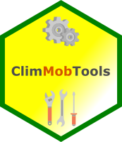

ClimMobTools
============

<!-- badges: start -->
[](https://cran.r-project.org/package=ClimMobTools) 
[](https://cran.r-project.org/web/checks/check_results_ClimMobTools.html)
[](https://cran.r-project.org/package=ClimMobTools) 
<!-- badges: end -->

*ClimMobTools*: API Client for the 'ClimMob' platform in R 
=========================================================================================================

## Overview

**ClimMobTools** the API Client for the 'ClimMob' platform in R. [ClimMob](https://climmob.net/) is an open source software for decentralized large-N trials with the 'tricot' approach. Developed by [Quiros et al. (2023)](http://dx.doi.org/10.2139/ssrn.4463406) 'tricot' turns the research paradigm on its head; instead of a few researchers designing complicated trials to compare several technologies in search of the best solutions, it enables many participants to carry out reasonably simple experiments that taken together can offer even more information.

## Package website

<https://agrdatasci.github.io/ClimMobTools/>

## Installation

The package may be installed from CRAN via

``` r
install.packages("ClimMobTools")
```

The development version can be installed via

``` r
library("remotes")
install_github("agrdatasci/ClimMobTools", build_vignettes = TRUE)

```


## Going further

The full functionality of **ClimMobTools** is illustrated in the package vignette. The vignette can be found on the [package website](https://agrdatasci.github.io/ClimMobTools/) or from within `R` once the package has been installed, e.g. via

``` r
vignette("Overview", package = "ClimMobTools")
```

## Meta

  - Please [report any issues or bugs](https://github.com/agrdatasci/ClimMobTools/issues).

  - License: MIT.

  - Get citation information for *ClimMobTools* in R by typing `citation(package = "ClimMobTools")`.

  - You are welcome to contribute to the *ClimMobTools* project. Please read our [contribution guidelines](CONTRIBUTING.md).

  - Please note that the *ClimMobTools* project is released with a [Contributor Code of Conduct](CODE_OF_CONDUCT.md). By participating in the *ClimMobTools* project you agree to abide by its terms.
