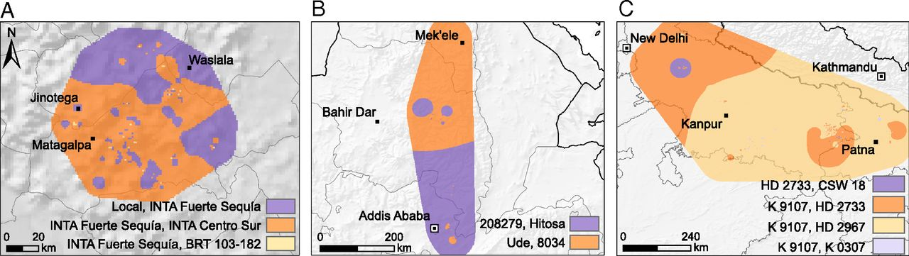

ClimMobTools
============

Overview
--------

The **ClimMobTools** package provides the toolkit employed in crowdsourcing citizen science projects under the *tricot* approach. Tricot, stands for "triadic comparison of technologies", an approach developed by [Bioversity International](https://www.bioversityinternational.org/) for the rapid assessment of on-farm evaluation trails in small-scale agriculture1.

To create your project, please visit the [ClimMob](https://climmob.net/blog/) portal.

### Methodological approach

In the *tricot* approach, each participant receives a set of technologies (generally three) randomly allocated as incomplete blocks from a larger set. It maintains spatial balance by assigning roughly equal frequencies of the varieties to each area. The trials required three moments of contact with the participants: (*i*) explaining the experiment and distributing the trial technologies, (*ii*) collecting evaluation data, and (*iii*) returning the results1.

*Fig. 1: Example of a set of varieties randomly assigned to a farmer in a tricot project*

Participants' independent observations are compiled and analysed centrally. A simple ranking-based feedback format allows even participants with low literacy skills to contribute their evaluation data through various channels, including mobile telephones.

### Statistical approach

For the data analysis, ClimMob employs the Plackettb-Luce model with the R package `PlackettLuce`2. The `PlackettLuce` package implements a generalization of the model jointly attributed to Plackett (1975)3 and Luce (1959)4 for modelling rankings data. The Plackettb-Luce model estimates for each tested technology the probability that it wins, beating all others in the set.

### Evidence on the tricot approach

Current evidence has demonstrated that: (*i*) the tricot approach engage motivated participants as citizen scientists5; (*ii*) the data generated by citizen scientists is reliable and can produce meaningful results for agricultural research6; (*iii*) the approach can engage farmers into the discussion for the future of local, sustainable plant breeding efforts7; (*iv*) addresses the challenge of variety replacement for climate adaptation in a way that is, at the same time, scalable and demand led8.

*Fig. 2: Variety recommendations based on average season predictions from Plackett-Luce models using climatic variables for (A) common bean in Nicaragua (Apante season), (B) durum wheat in Ethiopia (Meher season), and (C) bread wheat in India (Rabi season). Map categories show the top two varieties for each area according to their probability of winning over a base period (2002-2016). Source: van Etten et al (2019).*

### References

1. van Etten, J., Beza, E., Calderer, L. & van Duijvendijk, K. *et al.* First experiences with a novel farmer citizen science approach: Crowdsourcing participatory variety selection through on-farm triadic comparisons of technologies (tricot). *Experimental Agriculture* 1–22 (2016).

2. Turner, H., van Etten, J., Firth, D. & Kosmidis, I. Modelling rankings in R: The PlackettLuce package. *arXiv:1810.12068* (2018).

3. Plackett, R. L. The Analysis of Permutations. *Appl. Statist* **24**, 193–202 (1975).

4. Luce, R. D. *Individual Choice Behavior: A Theoretical Analysis*. (New York: Wiley, 1959).

5. Beza, E., Steinke, J., van Etten, J. & Reidsma, P. *et al.* What are the prospects for citizen science in agriculture? Evidence from three continents on motivation and mobile telephone use of resource-poor farmers. *PLOS ONE* **12**, e0175700 (2017).

6. Steinke, J., van Etten, J. & Zelan, P. M. The accuracy of farmer-generated data in an agricultural citizen science methodology. *Agronomy for Sustainable Development* **37**, 32 (2017).

7. Mancini, C., Kidane, Y. G., Mengistu, D. K. & Pè, M. E. *et al.* Joining smallholder farmers’ traditional knowledge with metric traits to select better varieties of Ethiopian wheat. *Scientific Reports* **7**, 9120 (2017).

8. van Etten, J., de Sousa, K., Aguilar, A. & Barrios, M. *et al.* Crop variety management for climate adaptation supported by citizen science. *Proceedings of the National Academy of Sciences* **116**, 4194–4199 (2019).
