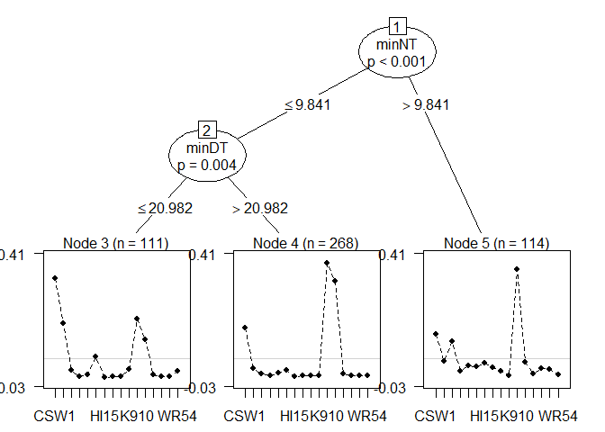
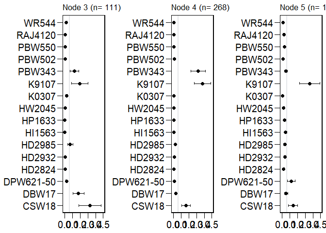

Analyse the ClimMob tricot data with PlackettLuce models
================
Kauê de Sousa
28 March, 2019

Breadwheat data
===============

Here I show an example using the `gosset::breadwheat` data. Which is a dataframe with data from crowdsourcing citizen-science trials of bread wheat (*Triticum aestivum*) varieties in India.

``` r
#library("devtools")
#install_github("kauedesousa/gosset", upgrade = "never")
library("gosset")
library("PlackettLuce")
library("qvcalc")
library("tidyverse")
library("cowplot")

data("breadwheat", package = "gosset")

print(breadwheat)
```

    ## # A tibble: 493 x 19
    ##    variety_a variety_b variety_c district village participant_name   age
    ##    <chr>     <chr>     <chr>     <chr>    <chr>   <chr>            <int>
    ##  1 CSW18     PBW502    HW2045    Vaishali Shembh~ Participant Nam~    63
    ##  2 WR544     HD2985    PBW550    Vaishali Shembh~ Participant Nam~    27
    ##  3 PBW343    HD2932    RAJ4120   Vaishali Patadh  Participant Nam~    29
    ##  4 HP1633    DBW17     CSW18     Vaishali Shembh~ Participant Nam~    51
    ##  5 CSW18     DBW17     HD2932    Vaishali Bhatha~ Participant Nam~    51
    ##  6 HP1633    HW2045    CSW18     Vaishali Shembh~ Participant Nam~    63
    ##  7 HW2045    HD2824    PBW550    Vaishali Bhatha~ Participant Nam~    36
    ##  8 DBW17     HI1563    RAJ4120   Vaishali Shembh~ Participant Nam~    62
    ##  9 HW2045    PBW502    HI1563    Vaishali Shembh~ Participant Nam~    45
    ## 10 HD2985    CSW18     PBW502    Vaishali Shembh~ Participant Nam~    42
    ## # ... with 483 more rows, and 12 more variables: gender <chr>,
    ## #   planting_date <date>, lon <dbl>, lat <dbl>, germination_best <chr>,
    ## #   germination_worst <chr>, grainquality_best <chr>,
    ## #   grainquality_worst <chr>, yield_best <chr>, yield_worst <chr>,
    ## #   overall_best <chr>, overall_worst <chr>

Preparing the data
------------------

We can convert this dataframe into a PlackettLuce rankings or grouped\_rankings using the function `gosset::to_rankings`. A object of class "rankings"" is a matrix of dense rankings that can be used to fit a Plackett-Luce model using `PlackettLuce::PlackettLuce`. A object of class "grouped\_rankings"" associates a group index with an object of class "rankings", then allows the rankings to be linked to covariates and fit a PlackettLuce model using `PlackettLuce::pltree`.

Let's see how it works. We can convert the `breadwheat` data into a rankings object using the function `gosset::to_rankings`. The argument `grouped.rankings` return a object of class "grouped\_rankings".

``` r
# this return a object of class "rankings"
R <- to_rankings(breadwheat, 
                 items = c("variety_a","variety_b","variety_c"), 
                 rankings = c("overall_best","overall_worst"),
                 type = "tricot")

print(R[1:10])
```

    ##  [1] "CSW18 > PBW502 > HW2045"   "HD2985 > PBW550 > WR544"  
    ##  [3] "PBW343 > HD2932 > RAJ4120" "CSW18 > DBW17 > HP1633"   
    ##  [5] "CSW18 > DBW17 > HD2932"    "CSW18 > HP1633 > HW2045"  
    ##  [7] "HW2045 > PBW550 > HD2824"  "RAJ4120 > DBW17 > HI1563" 
    ##  [9] "PBW502 > HI1563 > HW2045"  "CSW18 > HD2985 > PBW502"

``` r
# and this a object of class "grouped_rankings"
G <- to_rankings(breadwheat, 
                 items = c("variety_a","variety_b","variety_c"), 
                 rankings = c("overall_best","overall_worst"),
                 type = "tricot",
                 grouped.rankings = TRUE)

print(G[1:10])
```

    ##                      1                      2                      3 
    ## "CSW18 > PBW502 > ..." "HD2985 > PBW550  ..." "PBW343 > HD2932  ..." 
    ##                      4                      5                      6 
    ## "CSW18 > DBW17 >  ..." "CSW18 > DBW17 >  ..." "CSW18 > HP1633 > ..." 
    ##                      7                      8                      9 
    ## "HW2045 > PBW550  ..." "RAJ4120 > DBW17  ..." "PBW502 > HI1563  ..." 
    ##                     10 
    ## "CSW18 > HD2985 > ..."

``` r
# you can also use the function PlackettLuce::grouped_rankings on the object R

G <- PlackettLuce::grouped_rankings(R, index = seq_len(nrow(R)))

print(G[1:10])
```

    ##                      1                      2                      3 
    ## "CSW18 > PBW502 > ..." "HD2985 > PBW550  ..." "PBW343 > HD2932  ..." 
    ##                      4                      5                      6 
    ## "CSW18 > DBW17 >  ..." "CSW18 > DBW17 >  ..." "CSW18 > HP1633 > ..." 
    ##                      7                      8                      9 
    ## "HW2045 > PBW550  ..." "RAJ4120 > DBW17  ..." "PBW502 > HI1563  ..." 
    ##                     10 
    ## "CSW18 > HD2985 > ..."

Plackett Luce model
-------------------

Let's fit a PlackettLuce model without covariates, using `PlackettLuce::PlackettLuce`

``` r
mod <- PlackettLuce::PlackettLuce(R)

print(mod)
```

    ## Call: PlackettLuce::PlackettLuce(rankings = R)
    ## 
    ## Coefficients:
    ##     CSW18      DBW17  DPW621-50     HD2824     HD2932     HD2985  
    ##    0.0000    -1.1265    -1.8793    -2.8177    -2.1726    -1.6546  
    ##    HI1563     HP1633     HW2045      K0307      K9107     PBW343  
    ##   -2.9342    -2.8714    -2.8517    -2.9835     0.6579    -0.2207  
    ##    PBW502     PBW550    RAJ4120      WR544  
    ##   -2.5704    -2.7204    -2.7451    -2.7875

Model with covariates
---------------------

And then, we fit a model with covariates. But first, let's get some covariates using the related temperature data `breadwheat_modis`, which contains the MODIS data (day and night temperatur) for all plots in `breadwheat` data from the planting date until the end of the the experiment. We use the function `gosset::temperature` to get the heat stress indices. An explanation about each index is found in `help(temperature)`.

``` r
data("breadwheat_modis", package = "gosset")

# get some variables to include in the model
# the timespan will be from the planting date to maturity (120 days)
covars <- temperature(breadwheat_modis,
                      day.one = breadwheat$planting_date,
                      span = 120)
# combine the grouped_rankings and the covariates
data <- cbind(G, covars)

head(data)
```

    ##                      G    maxDT    minDT    maxNT    minNT SU TR      DTR
    ## 1 CSW18 > PBW502 > ... 34.89604 21.35828 18.47756 9.818497 25  0 13.12475
    ## 2 HD2985 > PBW550  ... 34.54961 21.35828 18.16879 9.818497 22  0 13.02957
    ## 3 PBW343 > HD2932  ... 36.00490 21.37138 19.09017 9.622138 31  0 13.51658
    ## 4 CSW18 > DBW17 >  ... 34.43414 21.35828 18.06586 9.818497 21  0 12.99701
    ## 5 CSW18 > DBW17 >  ... 33.72352 21.35828 17.47593 9.818497 16  0 12.82797
    ## 6 CSW18 > HP1633 > ... 34.54961 21.35828 18.16879 9.818497 22  0 13.02957

Now we fit the model using the function `PlackettLuce::pltree` with all covariates and defining a minimum size per node of 100 observations and a alpha of 0.05.

``` r
tree <- pltree(G ~ ., data = data, minsize = 100, alpha = 0.05)

print(tree)
```

    ## Plackett-Luce tree
    ## 
    ## Model formula:
    ## G ~ .
    ## 
    ## Fitted party:
    ## [1] root
    ## |   [2] minNT <= 9.84092
    ## |   |   [3] minDT <= 20.98244: n = 111
    ## |   |            CSW18      DBW17  DPW621-50     HD2824     HD2932     HD2985 
    ## |   |        0.0000000 -0.6064434 -2.6752026 -4.4050264 -3.7292062 -1.5429092 
    ## |   |           HI1563     HP1633     HW2045      K0307      K9107     PBW343 
    ## |   |       -5.6359870 -5.0909933 -4.5516142 -2.5104855 -0.5216187 -0.9693938 
    ## |   |           PBW502     PBW550    RAJ4120      WR544 
    ## |   |       -3.6586212 -4.6588009 -4.2618133 -2.7507239 
    ## |   |   [4] minDT > 20.98244: n = 268
    ## |   |            CSW18      DBW17  DPW621-50     HD2824     HD2932     HD2985 
    ## |   |        0.0000000 -1.7431909 -2.5302937 -3.3298539 -2.4252158 -1.9468887 
    ## |   |           HI1563     HP1633     HW2045      K0307      K9107     PBW343 
    ## |   |       -3.5544418 -3.2597236 -3.3816228 -3.3870518  0.8318600  0.6650256 
    ## |   |           PBW502     PBW550    RAJ4120      WR544 
    ## |   |       -2.6268809 -3.1535123 -3.1184293 -3.3366020 
    ## |   [5] minNT > 9.84092: n = 114
    ## |            CSW18      DBW17  DPW621-50     HD2824     HD2932     HD2985 
    ## |        0.0000000 -0.9900036 -0.1796977 -1.8956370 -1.3214397 -1.4007642 
    ## |           HI1563     HP1633     HW2045      K0307      K9107     PBW343 
    ## |       -1.1083090 -1.4134168 -1.8724497 -3.0966254  0.9287175 -1.0488785 
    ## |           PBW502     PBW550    RAJ4120      WR544 
    ## |       -2.4697942 -1.5844698 -1.7104924 -2.6043737 
    ## 
    ## Number of inner nodes:    2
    ## Number of terminal nodes: 3
    ## Number of parameters per node: 16
    ## Objective function (negative log-likelihood): 604.3677

Tree visualisation
------------------

Here I show some ways to visualise the PlackettLuce tree. First we can use the print method from partykit as a default.

``` r
plot(tree)
```



We can also use the function `gosset::plot_nodes` which uses `ggplot2` to plot the quasi-variance coefficients with error bars from `qvcalc::qvcalc`.

**Note:**The function needs improvement. All help is welcome.

``` r
plots <- plot_nodes(tree)

cowplot::plot_grid(plots[[1]],
                   plots[[2]],
                   plots[[3]], ncol = 3, align = "h")
```


